  

## Production / Deployed Projects

| Project | What it is | Stack |
|---|---|---|
| **[PNAA](https://github.com/Hack4Impact-UMD/new-philippine-nurses-association-of-america)** | A Management app for the Philippine Nurses Association of America | Next.js, Firebase, Supabase|
| **[CampStarfish](https://github.com/Hack4Impact-UMD/camp-starfish)** | Scheduling and Photo managment portal for Camp Starfish | Tanstack, Firebase |
| **[Children's Cancer Foundation](https://github.com/Hack4Impact-UMD/childrens-cancer-foundation)** | Audit, Review, and Approve Grants | React, Firebase |
| **[Jupiterp](https://github.com/Chase-Fournier/JupiterpMobile)** | Course scheduler for UMD students with shareable schedule encoding (Mobile) | Kotlin Multiplatform, Compose |
| **[JupiTerp](https://github.com/atcupps/Jupiterp)** | Course scheduler for UMD students with shareable schedule encoding | Svelete, Supabase |
| **[NHS APP](https://github.com/Chase-Fournier/honor_society_hour_tracker)** | Hour, Event, Meeting, and Communication for Honor Societies | Flutter Supabase |

## 🤝 Let's Connect 

  
  

Open to SWE internships & co-ops — Email me
 
